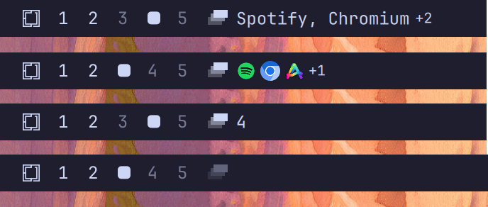
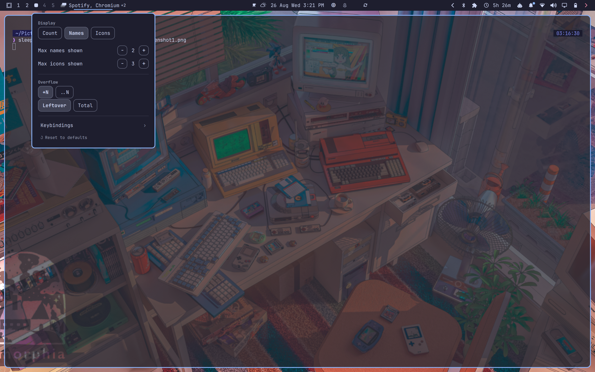
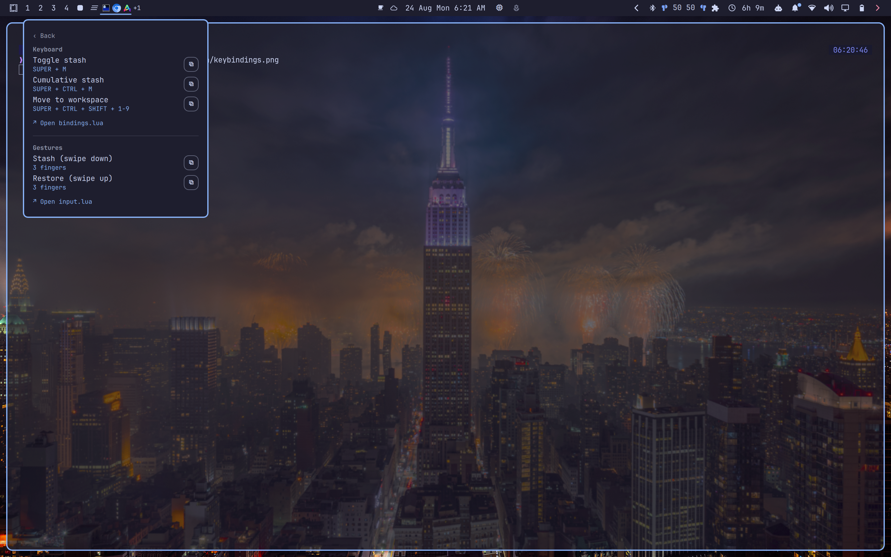

# Workspace Stash

Workspace-level minimize/restore for Omarchy Quattro. A downward gesture (or
a keyboard toggle) hides every window on the current workspace into one
global stash; an upward gesture brings the whole accumulated stash back onto
whichever workspace you're on when you ask for it. It is not a per-window
minimize system — there is one stash, and restoring always gives you all of
it.

Hyprland does not provide conventional desktop minimization. Workspace Stash
implements it by parking windows on a private `special:workspace-stash`
workspace, using their exact Hyprland addresses to bring them back, and
restoring their original layout on a best-effort basis.



## Features

- Stashes every eligible window on the current workspace with one gesture or
  keypress, and restores the whole accumulated stash with another
- Repeated stashes accumulate into the same stash rather than creating
  separate slots — restore always releases everything at once
- Restores tiled windows in an order that reconstructs their original
  Dwindle split structure, including relative split ratios, for common
  layouts (see Limitations)
- Restores floating windows to their exact captured position and size,
  clamped on-screen if the destination monitor is smaller than the one they
  were captured on
- Guards against Hyprland's own external-focus behavior ever revealing the
  private stash workspace as an unintended scratchpad
- Bulk workspace-move: send every window on the current workspace to another
  one, best-effort layout preserved, without following it there and without
  touching the stash at all
- A bar widget shows the stash as a count, application names, or icons, with
  a right-click menu for display settings, overflow-indicator settings, a
  one-click restore-defaults action, and a keybindings reference panel
- The bar widget is always visible — dimmed while the stash is empty, full
  opacity once it holds anything — so there's a discoverable entry point
  even before any keybinding is set up
- Tracks state reactively through Hyprland's live window model — no polling,
  no background daemon, no persisted state
- Reconstructs correctly after a Quickshell shell restart, purely by
  re-reading Hyprland
- Never moves the mouse cursor as a side effect of restoring or moving
  windows

## Requirements

- Omarchy with the Quattro shell plugin system
- Hyprland running in Lua configuration mode
- Quickshell (bundled with Omarchy Quattro)
- `wl-clipboard`, part of Omarchy's base install — used by the settings
  menu's keybindings page to copy a binding snippet to the clipboard

## Install

Review the source before installing. Omarchy plugins run as unsandboxed code
inside the long-running shell process.

```bash
omarchy plugin add https://github.com/devASstated/omarchy-workspace-stash.git --enable
```

The widget defaults to the left bar section. If you installed it without
`--enable`, enable it later with:

```bash
omarchy plugin enable io.github.devasstated.workspace-stash --section left
```

### Gestures

The published default is a 3-finger swipe: down to stash, up to restore.

```lua
-- Add to ~/.config/hypr/input.lua
hl.gesture({
  fingers = 3,
  direction = "down",
  action = function() hl.dispatch(hl.dsp.exec_cmd("omarchy-shell -q workspace-stash stash")) end,
})

hl.gesture({
  fingers = 3,
  direction = "up",
  action = function() hl.dispatch(hl.dsp.exec_cmd("omarchy-shell -q workspace-stash restore")) end,
})
```

Check `~/.config/hypr/input.lua` for an existing 3-finger vertical gesture
first — Omarchy's own defaults often bind one to the scratchpad. If you
already have one, change or remove it yourself; installing this plugin never
touches your Hyprland configuration. Change `fingers = 3` to `fingers = 4` if
you'd rather keep three fingers for something else — everything else about
the behavior is identical.

### Keyboard

`SUPER + M` toggles the stash: stashes the current workspace if the stash is
empty, restores the whole stash onto the current workspace otherwise.

```lua
-- Add to ~/.config/hypr/bindings.lua
hl.bind(
  "SUPER + M",
  hl.dsp.exec_cmd([[omarchy-shell -q workspace-stash toggle]]),
  { description = "Toggle workspace stash" }
)
```

An optional power-user binding, `SUPER + CTRL + M`, always stashes
(cumulative, never restores) regardless of current stash state — useful for
building up a stash from several workspaces before restoring it all
somewhere else:

```lua
hl.bind(
  "SUPER + CTRL + M",
  hl.dsp.exec_cmd([[omarchy-shell -q workspace-stash stash]]),
  { description = "Stash current workspace (cumulative)" }
)
```

Bulk workspace-move is a separate, stateless operation — it never reads or
writes the stash. It moves every eligible window on the current workspace to
a target workspace, best-effort layout preserved, without following the view
there. The published default is `SUPER + CTRL + SHIFT + 1` through `9`, plus
`0` for workspace 10:

```lua
-- Add to ~/.config/hypr/bindings.lua
for workspace = 1, 10 do
  local key = "code:" .. tostring(workspace + 9)
  hl.bind(
    "SUPER + CTRL + SHIFT + " .. key,
    hl.dsp.exec_cmd("omarchy-shell -q workspace-stash moveTo " .. tostring(workspace)),
    { description = "Move workspace to workspace " .. workspace }
  )
end
```

Before adding any of these, confirm the keys aren't already assigned:

```bash
omarchy menu keybindings --print
```

If it is, bind a different key instead of replacing the existing action.
Apply and validate any change with:

```bash
hyprctl reload
hyprctl configerrors
```

See `examples/bindings.lua` for the complete, copy-pasteable version of all
of the above.

## Use

| Input | Action |
| --- | --- |
| 3-finger swipe down (or `SUPER+CTRL+M`) | Stash the current workspace, adding to any existing stash |
| 3-finger swipe up (or `SUPER+M` with a non-empty stash) | Restore the entire stash onto the current workspace |
| `SUPER+M` with an empty stash | Stash the current workspace |
| `SUPER+CTRL+SHIFT+1-9,0` | Move every window on the current workspace to workspace 1-10 (never touches the stash) |
| Left-click the bar widget | Stash the current workspace if the stash is empty, restore it otherwise — same as `SUPER+M` |
| Right-click the bar widget | Open the settings menu |

The bar widget is always visible: dimmed while the stash is empty, full
opacity once it holds anything, so there's always a discoverable way to use
the plugin even before any keybinding is set up.

### Configuration

Right-click the bar widget to open the settings menu: display style (count /
names / icons), name/icon overflow limits, the overflow indicator's style
and count mode, a restore-defaults action, and a keybindings reference page
with copy-to-clipboard and open-config-file buttons.





Settings can also be set from the command line:

```bash
omarchy bar set io.github.devasstated.workspace-stash displayMode names
omarchy bar set io.github.devasstated.workspace-stash maxNames 6
omarchy bar set io.github.devasstated.workspace-stash maxIcons 8
omarchy bar set io.github.devasstated.workspace-stash overflowStyle ellipsis
omarchy bar set io.github.devasstated.workspace-stash overflowCountMode total
```

| Setting | Default | Notes |
| --- | --- | --- |
| `displayMode` | `count` | `count`, `names`, or `icons`. `count` is the most stable option across icon themes, long application names, and narrow bars. |
| `maxNames` | `2` | Names beyond this collapse into the overflow indicator below. |
| `maxIcons` | `3` | Icons beyond this collapse into the overflow indicator below. |
| `overflowStyle` | `badge` | `badge` (`+N`) or `ellipsis` (`..N`). Independent of `overflowCountMode`. Not shown when `displayMode` is `count`. |
| `overflowCountMode` | `leftover` | `leftover` (how many are hidden) or `total` (the full stashed count). Independent of `overflowStyle`. Not shown when `displayMode` is `count`. |

The settings menu's restore-defaults action resets all of the above back to
these defaults in one confirmed step.

## Update

```bash
omarchy plugin update io.github.devasstated.workspace-stash
```

## Remove

Restore your stash before removing the plugin, then run:

```bash
omarchy plugin remove io.github.devasstated.workspace-stash
```

Removing the plugin does not close or move stashed windows out of the
special workspace. If the plugin is unavailable while windows remain
stashed, reveal them with:

```bash
hyprctl dispatch 'hl.dsp.workspace.toggle_special("workspace-stash")'
```

Move the windows to a normal workspace, then hide the special workspace
again the same way.

## Limitations

- **Layout restoration is best-effort, not exact**, for tiled windows. Any
  layout buildable one window at a time — a straight sequence of splits, or
  a lone window alongside a stacked/grouped set, however many windows deep —
  restores reliably, including split ratios. A genuinely multi-branch
  layout, where two *independently*-split groups sit side by side (a true
  2×2 grid is the clearest example), isn't reliably reconstructed: Hyprland
  may fall back to tiling those windows in a different arrangement. Nothing
  is lost or hidden in this case — every window still comes back — only its
  exact position/size may differ from where it was.
- **The stash is global**, not per-workspace. Repeated stash gestures from
  different workspaces accumulate into the same stash; there's no way to
  restore only one previous stash operation.
- **The originally-focused window isn't guaranteed to end up focused again**
  after a restore, especially when several windows are involved.
- **No cross-session persistence.** The stash lives in Hyprland's live
  window state; if you log out or restart the compositor with windows still
  stashed, they're gone along with every other window in that session, the
  same as any other workspace.

## Development

Validate the repository with:

```bash
omarchy plugin validate .
qmllint Service.qml BarWidget.qml
```

See `docs/FEATURES.md` for the full behavioral specification and
`docs/DESIGN-JOURNEY.md` for the history of how the implementation reached
it, including the bugs found and rejected approaches along the way.

## License

Workspace Stash is licensed under the [MIT License](LICENSE).
